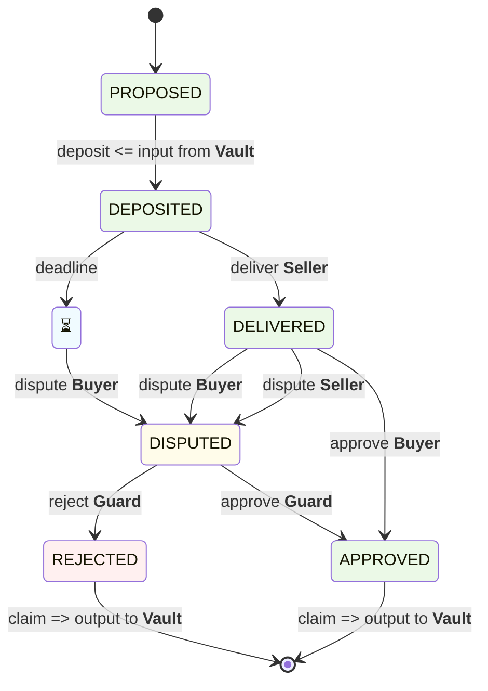

# Chameleon Escrow

## Escrow contract

```mermaid
stateDiagram
    classDef success fill:#EBF9E7
    classDef info fill:#F0FBFF
    classDef warning fill:#FFFCEA
    classDef danger fill:#FFF0F0

    class DRAFT info
    class PROPOSED success
    class DEPOSITED success
    class DELIVERED success
    class APPROVED success
    class DISPUTED warning
    class REJECTED danger
    class deadline info

    state "⏳" as deadline

    [*] --> PROPOSED
    PROPOSED --> DEPOSITED  : deposit <= input from **Vault**
    DEPOSITED --> deadline  : deadline
    deadline --> DISPUTED   : dispute **Buyer**
    DEPOSITED --> DELIVERED : deliver **Seller**

    DELIVERED --> DISPUTED  : dispute **Buyer**
    DELIVERED --> DISPUTED  : dispute **Seller**
    DELIVERED --> APPROVED  : approve **Buyer**

    DISPUTED --> REJECTED   : reject **Guard**
    DISPUTED --> APPROVED   : approve **Guard**

    REJECTED --> [*]        : claim => output to **Vault**
    APPROVED --> [*]        : claim => output to **Vault**
```
