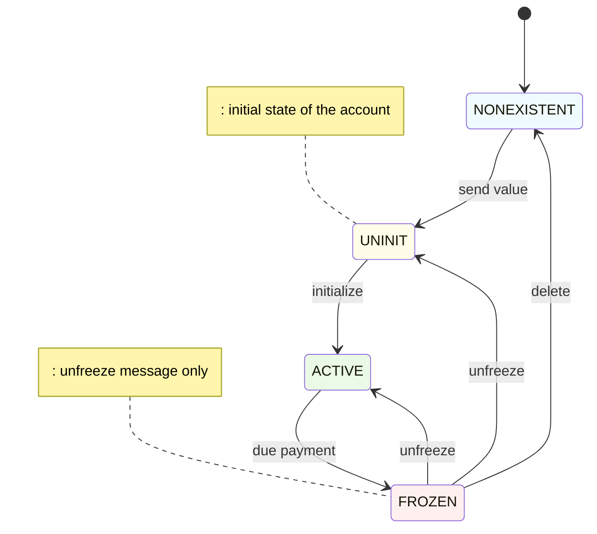
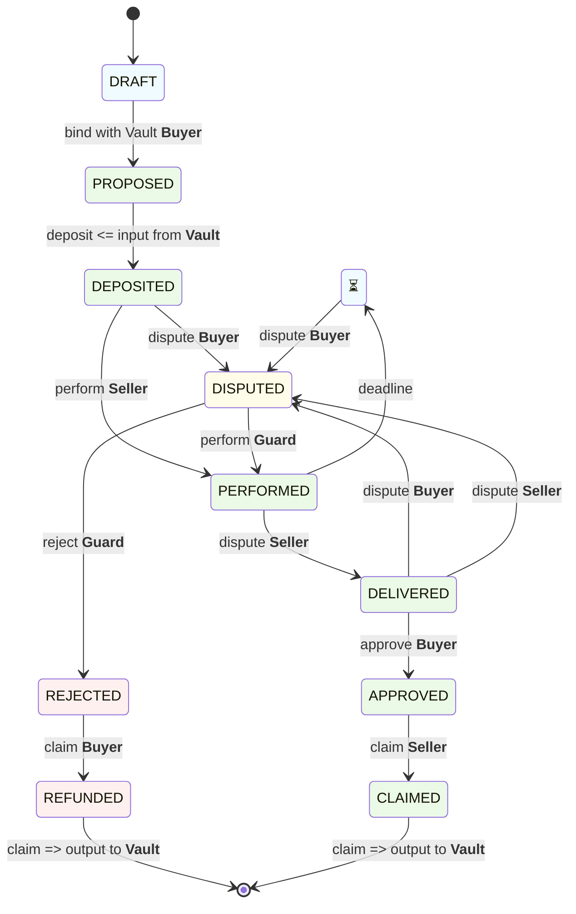
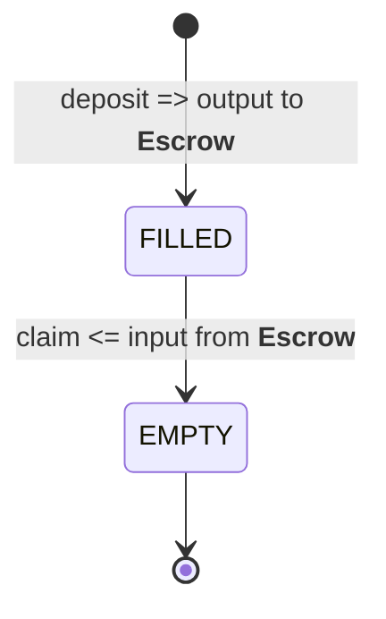

# Chameleon Escrow

**Chameleon Escrow** a system separating guarantee logic from asset management across diverse value forms

## Overview

Chameleon Escrow is an escrow solution that separates the guarantee logic from the asset custody mechanism, this modularity allows it to work with different types of assets — tokens, digital assets or other transferable values without changing the underlying `Escrow` contract, interoperating with different `Vault` implementations, the same escrow structure can easily handle multiple forms of value.

    

## Key Features

TBD

## How It Works

TBD

## How It Uses

TBD

## Life circle contract/account

## Escrow contract

## Vault contract

